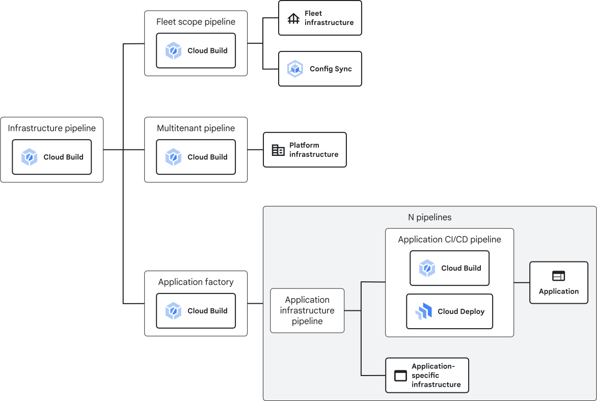

# 1. Bootstrap phase

The bootstrap phase establishes the 3 initial pipelines of the Enterprise Application blueprint. These pipelines are:

- the Multitenant Infrastructure pipeline
- the Application Factory
- the Fleet-Scope pipeline

An overview of the deployment methodology for the Enterprise Application blueprint is shown below.


Each pipeline has the following associated resources:

- 2 Cloud Build triggers
  - 1 trigger to run Terraform Plan commands upon changes to a non-main git branch
  - 1 trigger to run Terraform Apply commands upon changes to the main git branch
- 3 Cloud Storage buckets
  - Terraform State bucket, to store the current state
  - Build Artifacts bucket, to store any artifacts generated during the build process, such as `.tfplan` files
  - Build Logs bucket, to store the logs from the build process
- 1 service account for executing the Cloud Build build process

## Usage

### Pre-requisites

#### Secrets Project

You will need a Google Cloud project with [Secret Manager](https://cloud.google.com/security/products/secret-manager) to store your git credentials, throughout the documentation this will be referenced as `$GIT_SECRET_PROJECT`.

#### Cloud Build with Github Pre-requisites

To proceed with GitHub as your git provider you will need:

- An authenticated GitHub account. The steps in this documentation assumes you have a configured SSH key for cloning and modifying repositories.
- A **private** [GitHub repository](https://docs.github.com/en/repositories/creating-and-managing-repositories/creating-a-new-repository) for each one of the repositories below:
  - Multitenant (`eab-multitenant`)
  - Fleetscope (`eab-fleetscope`)
  - Application Factory (`eab-applicationfactory`)

   > Note: Default names for the repositories are, in sequence: `eab-multitenant`, `eab-fleetscope` and `eab-applicationfactory`; If you choose other names for your repository make sure you update `terraform.tfvars` the repository names under `cloudbuildv2_repository_config` variable.

- [Install Cloud Build App on Github](https://github.com/apps/google-cloud-build). After the installation, take note of the application id, it will be used later.
- [Create Personal Access Token on Github with `repo` and `read:user` (or if app is installed in org use `read:org`)](https://docs.github.com/en/authentication/keeping-your-account-and-data-secure/creating-a-personal-access-token) - After creating the token in Secret Manager, you will use the secret id in the `terraform.tfvars` file.
- Create a secret for the Github Cloud Build App ID:

   ```bash
   APP_ID_VALUE=<replace_with_app_id>
   printf $APP_ID_VALUE | gcloud secrets create github-app-id --project=$GIT_SECRET_PROJECT --data-file=-
   ```

- Take note of the secret id, it will be used in `terraform.tfvars` later on:

   ```bash
   gcloud secrets describe github-app-id --project=$GIT_SECRET_PROJECT --format="value(name)"
   ```

- Create a secret for the Github Personal Access Token:

   ```bash
   GITHUB_TOKEN=<replace_with_token>
   printf $GITHUB_TOKEN | gcloud secrets create github-pat --project=$GIT_SECRET_PROJECT --data-file=-
   ```

- Take note of the secret id, it will be used in `terraform.tfvars` later on:

   ```bash
   gcloud secrets describe github-pat --project=$GIT_SECRET_PROJECT --format="value(name)"
   ```

- Populate your `terraform.tfvars` file in `1-bootstrap` with the Cloud Build 2nd Gen configuration variable, here is an example:

   ```hcl
   cloudbuildv2_repository_config = {
      repo_type = "GITHUBv2"

      repositories = {
         multitenant = {
            repository_name = "eab-multitenant"
            repository_url  = "https://github.com/your-org/eab-multitenant.git"
         }

         applicationfactory = {
            repository_name = "eab-applicationfactory"
            repository_url  = "https://github.com/your-org/eab-applicationfactory.git"
         }

         fleetscope = {
            repository_name = "eab-fleetscope"
            repository_url  = "https://github.com/your-org/eab-fleetscope.git"
         }
      }

      github_secret_id                            = "projects/REPLACE_WITH_PRJ_NUMBER/secrets/github-pat" # Personal Access Token Secret
      github_app_id_secret_id                     = "projects/REPLACE_WITH_PRJ_NUMBER/secrets/github-app-id" # App ID value secret
   }
   ```

#### Cloud Build with Gitlab Pre-requisites

To proceed with Gitlab as your git provider you will need:

- An authenticated Gitlab account. The steps in this documentation assumes you have a configured SSH key for cloning and modifying repositories.
- A **private** GitLab repository for each one of the repositories below:
  - Multitenant (`eab-multitenant`)
  - Fleetscope (`eab-fleetscope`)
  - Application Factory (`eab-applicationfactory`)

   > Note: Default names for the repositories are, in sequence: `eab-multitenant`, `eab-fleetscope` and `eab-applicationfactory`; If you choose other names for your repository make sure you update `terraform.tfvars` the repository names under `cloudbuildv2_repository_config` variable.

- An access token with the `api` scope to use for connecting and disconnecting repositories.

- An access token with the `read_api` scope to ensure Cloud Build repositories can access source code in repositories.

- Create a secret for the Gitlab API Access Token:

   ```bash
   GITLAB_API_TOKEN=<replace_with_app_id>
   printf $GITLAB_API_TOKEN | gcloud secrets create gitlab-api-token --project=$GIT_SECRET_PROJECT --data-file=-
   ```

- Take note of the secret id, it will be used in `terraform.tfvars` later on:

   ```bash
   gcloud secrets describe gitlab-api-token --project=$GIT_SECRET_PROJECT --format="value(name)"
   ```

- Create a secret for the Gitlab Read API Access Token:

   ```bash
   GITLAB_READ_API_TOKEN=<replace_with_token>
   printf $GITLAB_READ_API_TOKEN | gcloud secrets create gitlab-read-api-token --project=$GIT_SECRET_PROJECT --data-file=-
   ```

- Take note of the secret id, it will be used in `terraform.tfvars` later on:

   ```bash
   gcloud secrets describe gitlab-read-api-token --project=$GIT_SECRET_PROJECT --format="value(name)"
   ```

- Generate a random 36 character string that will be used as the Webhook Secret:

   ```bash
   GITLAB_WEBHOOK=<replace_with_webhook>
   printf $GITLAB_WEBHOOK | gcloud secrets create gitlab-webhook --project=$GIT_SECRET_PROJECT --data-file=-
   ```

   > NOTE: for testing purposes, you may use the following command to generate the webhook in bash: `GITLAB_WEBHOOK=$(cat /dev/urandom | tr -dc "[:alnum:]" | head -c 36)`

- Take note of the secret id, it will be used in `terraform.tfvars` later on:

   ```bash
   gcloud secrets describe gitlab-webhook --project=$GIT_SECRET_PROJECT --format="value(name)"
   ```

- Populate your `terraform.tfvars` file in `1-bootstrap` with the Cloud Build 2nd Gen configuration variable, here is an example:

   ```hcl
   cloudbuildv2_repository_config = {
      repo_type = "GITLABv2"

      repositories = {
         multitenant = {
            repository_name = "eab-multitenant"
            repository_url  = "https://gitlab.com/your-group/eab-multitenant.git"
         }

         applicationfactory = {
            repository_name = "eab-applicationfactory"
            repository_url  = "https://gitlab.com/your-group/eab-applicationfactory.git"
         }

         fleetscope = {
            repository_name = "eab-fleetscope"
            repository_url  = "https://gitlab.com/your-group/eab-fleetscope.git"
         }
      }

      gitlab_authorizer_credential_secret_id         = "projects/REPLACE_WITH_PRJ_NUMBER/secrets/gitlab-api-token"
      gitlab_read_authorizer_credential_secret_id    = "projects/REPLACE_WITH_PRJ_NUMBER/secrets/gitlab-read-api-token"
      gitlab_webhook_secret_id                       = "projects/REPLACE_WITH_PRJ_NUMBER/secrets/gitlab-webhook"
   }
   ```

### Deploying with Cloud Build

#### Deploying on Enterprise Foundation blueprint

If you have previously deployed the Enterprise Foundation blueprint, create the pipelines in this phase by pushing the contents of this folder to a [workload repo created at stage 5](https://github.com/terraform-google-modules/terraform-example-foundation/blob/master/5-app-infra/README.md). Instead of deploying to multiple environments, create these pipelines in the common folder of the foundation.

Start at "5. Clone the `bu1-example-app` repo". Replace the contents of that repo with the contents of this folder.

### Running Terraform locally

#### Requirements

You will need a project to host your resources, you can manually create it:

```txt
example-organization
└── fldr-common
    └── prj-c-eab-bootstrap
```

#### Step-by-Step

1. The next instructions assume that you are in the `terraform-google-enterprise-application/1-bootstrap` folder.

   ```bash
   cd terraform-google-enterprise-application/1-bootstrap
   ```

1. Rename `terraform.example.tfvars` to `terraform.tfvars`.

   ```bash
   mv terraform.example.tfvars terraform.tfvars
   ```

1. Update the `terraform.tfvars` file with your project id. If you are using Github or Gitlab as your Git provider for Cloud Build, you will need to configure the `cloudbuildv2_repository_config` variable as described in the following sections:
   - [Cloud Build with Github Pre-requisites](#cloud-build-with-github-pre-requisites)
   - [Cloud Build with Gitlab Pre-requisites](#cloud-build-with-gitlab-pre-requisites)

You can now deploy the common environment for these pipelines.

1. Run `init` and `plan` and review the output.

   ```bash
   terraform init
   terraform plan
   ```

1. Run `apply`.

   ```bash
   terraform apply
   ```

If you receive any errors or made any changes to the Terraform config or `terraform.tfvars`, re-run `terraform plan` before you run `terraform apply`.

### Updating `backend.tf` files on the repository

Within the repository, you'll find `backend.tf` files that define the GCS bucket for storing the Terraform state. By running the commands below, instances of `UPDATE_ME` placeholders in these files will be automatically replaced with the actual name of your GCS bucket.

1. Running the series of commands below will update the remote state bucket for `backend.tf` files on the repository.

   ```bash
   export backend_bucket=$(terraform output -raw state_bucket)
   echo "backend_bucket = ${backend_bucket}"

   cp backend.tf.example backend.tf
   cd ..

   for i in `find . -name 'backend.tf'`; do sed -i'' -e "s/UPDATE_ME/${backend_bucket}/" $i; done
   ```

1. Re-run `terraform init`. When you're prompted, agree to copy Terraform state to Cloud Storage.

   ```bash
   cd 1-bootstrap

   terraform init
   ```

<!-- BEGINNING OF PRE-COMMIT-TERRAFORM DOCS HOOK -->
## Inputs

| Name | Description | Type | Default | Required |
|------|-------------|------|---------|:--------:|
| billing\_account | The billing account id associated with the project, e.g. XXXXXX-YYYYYY-ZZZZZZ | `string` | n/a | yes |
| bucket\_force\_destroy | When deleting a bucket, this boolean option will delete all contained objects. If false, Terraform will fail to delete buckets which contain objects. | `bool` | `false` | no |
| bucket\_prefix | Name prefix to use for buckets created. | `string` | `"bkt"` | no |
| cloudbuildv2\_repository\_config | Configuration for integrating repositories with Cloud Build v2:<br>  - repo\_type: Specifies the type of repository. Supported types are 'GITHUBv2', 'GITLABv2', and 'CSR'.<br>  - repositories: A map of repositories to be created. The key must match the exact name of the repository. Each repository is defined by:<br>      - repository\_name: The name of the repository.<br>      - repository\_url: The URL of the repository.<br>  - github\_secret\_id: (Optional) The personal access token for GitHub authentication.<br>  - github\_app\_id\_secret\_id: (Optional) The application ID for a GitHub App used for authentication.<br>  - gitlab\_read\_authorizer\_credential\_secret\_id: (Optional) The read authorizer credential for GitLab access.<br>  - gitlab\_authorizer\_credential\_secret\_id: (Optional) The authorizer credential for GitLab access.<br>  - gitlab\_webhook\_secret\_id: (Optional) The secret ID for the GitLab WebHook.<br>  - gitlab\_enterprise\_host\_uri: (Optional) The URI of the GitLab Enterprise host this connection is for. If not specified, the default value is https://gitlab.com.<br>  - gitlab\_enterprise\_service\_directory: (Optional) Configuration for using Service Directory to privately connect to a GitLab Enterprise server. This should only be set if the GitLab Enterprise server is hosted on-premises and not reachable by public internet. If this field is left empty, calls to the GitLab Enterprise server will be made over the public internet. Format: projects/{project}/locations/{location}/namespaces/{namespace}/services/{service}.<br>  - gitlab\_enterprise\_ca\_certificate: (Optional) SSL certificate to use for requests to GitLab Enterprise.<br>Note: When using GITLABv2, specify `gitlab_read_authorizer_credential` and `gitlab_authorizer_credential` and `gitlab_webhook_secret_id`.<br>Note: When using GITHUBv2, specify `github_pat` and `github_app_id`.<br>Note: If 'cloudbuildv2\_repository\_config' variable is not configured, CSR (Cloud Source Repositories) will be used by default. | <pre>object({<br>    repo_type = string # Supported values are: GITHUBv2, GITLABv2 and CSR<br>    # repositories to be created<br>    repositories = object({<br>      multitenant = object({<br>        repository_name = optional(string, "eab-multitenant")<br>        repository_url  = string<br>      }),<br>      applicationfactory = object({<br>        repository_name = optional(string, "eab-applicationfactory")<br>        repository_url  = string<br>      }),<br>      fleetscope = object({<br>        repository_name = optional(string, "eab-fleetscope")<br>        repository_url  = string<br>      }),<br>    })<br>    # Credential Config for each repository type<br>    github_secret_id                            = optional(string)<br>    github_app_id_secret_id                     = optional(string)<br>    gitlab_read_authorizer_credential_secret_id = optional(string)<br>    gitlab_authorizer_credential_secret_id      = optional(string)<br>    gitlab_webhook_secret_id                    = optional(string)<br>    gitlab_enterprise_host_uri                  = optional(string)<br>    gitlab_enterprise_service_directory         = optional(string)<br>    gitlab_enterprise_ca_certificate            = optional(string)<br>  })</pre> | <pre>{<br>  "repo_type": "CSR",<br>  "repositories": {<br>    "applicationfactory": {<br>      "repository_url": ""<br>    },<br>    "fleetscope": {<br>      "repository_url": ""<br>    },<br>    "multitenant": {<br>      "repository_url": ""<br>    }<br>  }<br>}</pre> | no |
| common\_folder\_id | Folder ID in which to create all application admin projects, must be prefixed with 'folders/' | `string` | n/a | yes |
| envs | Environments | <pre>map(object({<br>    billing_account    = string<br>    folder_id          = string<br>    network_project_id = string<br>    network_self_link  = string<br>    org_id             = string<br>    subnets_self_links = list(string)<br>  }))</pre> | n/a | yes |
| folder\_id | Folder ID | `string` | n/a | yes |
| location | Location for build buckets. | `string` | `"us-central1"` | no |
| org\_id | Organization ID | `string` | n/a | yes |
| project\_id | Project ID for initial resources | `string` | n/a | yes |
| service\_perimeter\_mode | Service perimeter mode: ENFORCE, DRY\_RUN. | `string` | `"ENFORCE"` | no |
| service\_perimeter\_name | Service perimeter full name. | `string` | `null` | no |
| tf\_apply\_branches | List of git branches configured to run terraform apply Cloud Build trigger. All other branches will run plan by default. | `list(string)` | <pre>[<br>  "development",<br>  "nonproduction",<br>  "production"<br>]</pre> | no |
| trigger\_location | Location of for Cloud Build triggers created in the workspace. If using private pools should be the same location as the pool. | `string` | `"us-central1"` | no |
| workerpool\_network\_id | The network definition that the workers are peered to. Must be in the format projects/{project}/global/networks/{network}, where {project} is a project number, such as 12345, and {network} is the name of a VPC network in the project. | `string` | n/a | yes |
| workerpool\_network\_project\_id | Workepool network project. | `string` | `null` | no |

## Outputs

| Name | Description |
|------|-------------|
| artifacts\_bucket | Bucket for storing TF plans |
| cb\_private\_worker\_pool\_id | Private Worker Pool id for Cloud Build. |
| cb\_service\_accounts\_emails | Service Accounts for the Multitenant Administration Cloud Build Triggers |
| logs\_bucket | Bucket for storing TF logs |
| project\_id | Project ID |
| source\_repo\_urls | Source repository URLs |
| state\_bucket | Bucket for storing TF state |
| tf\_project\_id | Google Artifact registry terraform project id. |
| tf\_repository\_name | Name of Artifact Registry repository for Terraform image. |
| tf\_tag\_version\_terraform | Docker tag version terraform. |

<!-- END OF PRE-COMMIT-TERRAFORM DOCS HOOK -->
