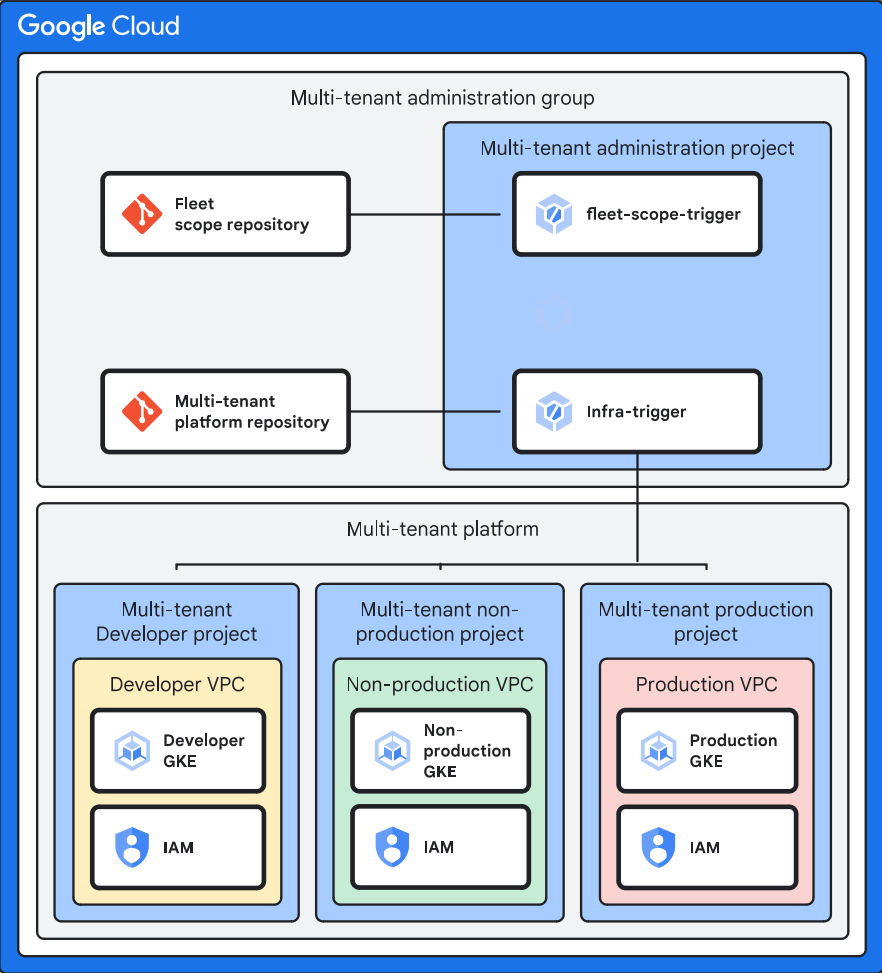

# 2. Multitenant Infrastructure phase

This phase deploys a multi-tenant Google Kubernetes Engine (GKE) cluster environment, optionally with VPC Service Controls (VPC-SC) and Cloud Armor integration. It supports both Standard and Autopilot cluster types and automates project creation, network configuration, and security policies.

<table>
<tbody>
<tr>
<td><a href="../1-bootstrap">1-bootstrap</a></td>
<td>Bootstraps streamlines the bootstrapping process for Enterprise Applications on Google Cloud Platform (GCP)</td>
</tr>
<tr>
<td>2-multitenant (this file)</td>
<td>Deploys GKE clusters optimized for multi-tenancy within an enterprise environment.</td>
</tr>
<tr>
<td><a href="../3-fleetscope">3-fleetscope</a></td>
<td>Set-ups Google Cloud Fleet, enabling centralized management of multiple Kubernetes clusters.</td>
</tr>
<tr>
<td><a href="../4-appfactory">4-appfactory</a></td>
<td>Sets up infrastructure and CI/CD pipelines for a single application or microservice on Google Cloud</td>
</tr>
<tr>
<td><a href="../5-appinfra">5-appinfra</a></td>
<td>Set up application infrastructure pipeline aims to establish a streamlined CI/CD workflow for applications, enabling automated deployments to multiple environments (GKE clusters).</td>
</tr>
<tr>
<td><a href="../6-appsource">6-appsource</a></td>
<td>Deploys a modified version of a [simple example](https://github.com/GoogleContainerTools/skaffold/tree/main/examples/getting-started) for skaffold.</td>
</tr>
</tbody>
</table>

## Purpose

The phase aims to provide a repeatable and configurable way to deploy a GKE cluster optimized for multi-tenancy within an enterprise environment. It handles project setup, networking, and security considerations, allowing application teams to focus on deploying their workloads.

An overview of the multitenant infrastructure pipeline is shown below.


The following resources are created:

- __Google Cloud Project (Optional):__ A new Google Cloud project dedicated to hosting the GKE cluster. This project is created if `create_cluster_project` is set to true.
- __GKE Cluster (Standard or Autopilot):__ A GKE cluster, either Standard or Autopilot, configured according to the specified variables.
- __VPC Network Configuration:__ Configures networking, including subnetworks and firewall rules.
- __Cloud Armor Policy:__ A Cloud Armor policy to protect the GKE cluster from common web attacks.
- __Service Accounts: Service__ accounts for the GKE cluster nodes and project, with appropriate IAM roles.
- __VPC Service Controls (Optional):__ Configures VPC-SC perimeter and access levels, if `service_perimeter_name` is set.
- __Managed SSL Certificates:__ Creates Google Compute Managed SSL Certificates for applications.
- __Global IP Addresses:__ Creates global static IP addresses for applications.
- __Egress/Ingress Policies:__ Creates Egress and Ingress policies for VPC-SC to allow communication between the cluster, network project, and Cloud Build worker pool (if applicable).

```txt
.
└── fldr-seed/
  ├── prj-seed
  ├── fldr-common/
  │   ├── ...
  ├── fldr-development/
  │   ├── prj-vpc-dev
  │   ├── prj-gke-dev
  │   └── ...
  ├── fldr-nonproduction/
  │   ├── prj-vpc-nonprod
  │   ├── prj-gke-dev
  │   └── ...
  └──  fldr-prod/
      ├── prj-vpc-prod
      ├── prj-gke-dev
      └── ...
```

## Prerequisites

1. Provision of the per-environment folder, network project, network, and subnetwork(s).
1. 1-bootstrap phase executed successfully.

### Environments

You will need to provide information about your environment. It includes:

- A biling account to be linked to the cluster projects,
- The environment folder id where the cluster project will be created,
- The network project id where the cluster network is going to be hosted,
- The network self link who will be used by the cluster,
- The subnetworks self-links who will be used by the cluster,
- The organization id

__Note:__ You can use one or more regions to deploy your cluster. This will be determined by the subnetworks provided. For each subnetwork provided, a cluster will be created in the same region of the subnetwork.

You can see the variable example below. Remember to include your own values.

```hcl
envs = {
  developemnt = {
    billing_account    = "000000-000000-000000"
    folder_id          = "1234567890123"
    network_project_id = "shared-vpc-project"
    network_self_link  = "https://www.googleapis.com/compute/v1/projects/shared-vpc-project/global/networks/the-network"
    org_id             = "2345678901234"
    subnets_self_links = [
      "https://www.googleapis.com/compute/v1/projects/shared-vpc-project/regions/us-central1/subnetworks/subnet-us-central1",
      "https://www.googleapis.com/compute/v1/projects/shared-vpc-project/regions/us-east1/subnetworks/subnet-us-east1"
    ]
  },
  nonproduction = {
    billing_account    = "111111-111111-111111"
    folder_id          = "4567890123456"
    network_project_id = "shared-vpc-project-nonprod"
    network_self_link  = "https://www.googleapis.com/compute/v1/projects/shared-vpc-project-nonprod/global/networks/the-network"
    org_id             = "2345678901234"
    subnets_self_links = [
      "https://www.googleapis.com/compute/v1/projects/shared-vpc-project-nonprod/regions/us-central1/subnetworks/subnet-us-central1",
      "https://www.googleapis.com/compute/v1/projects/shared-vpc-project-nonprod/regions/us-east1/subnetworks/subnet-us-east1"
    ]
  },
  production = {
    billing_account    = "111111-111111-111111"
    folder_id          = "4567890123456"
    network_project_id = "shared-vpc-project-prod"
    network_self_link  = "https://www.googleapis.com/compute/v1/projects/shared-vpc-project-prod/global/networks/the-network"
    org_id             = "2345678901234"
    subnets_self_links = [
      "https://www.googleapis.com/compute/v1/projects/shared-vpc-project-prod/regions/us-central1/subnetworks/subnet-us-central1",
      "https://www.googleapis.com/compute/v1/projects/shared-vpc-project-prod/regions/us-east1/subnetworks/subnet-us-east1"
    ]
  }
}
```

### Application

For each application to be deployed in this solution, please provide:

- A distinct application name as key;
  - A distinct acronym for each application, maximun size of 3 characters,  it will be used as a shorten identificator;
  - IP addresses for each application, when needed;
  - Certificates for each application, when needed;

```hcl
apps = {
  "myapp1" = {
    acronym          = "MA1"
    ip_address_names = ["ip-myapp1-01", "ip-myapp1-02"]
    certificates = {
      "cert-web" = [
        "-----BEGIN CERTIFICATE-----",
        "...",
        "-----END CERTIFICATE-----"
      ],
      "cert-db" = [
        "-----BEGIN CERTIFICATE-----",
        "...",
        "-----END CERTIFICATE-----"
      ]
    }
  }

  "anotherapp" = {
    acronym = "AAP"
    # ip_address_names and certificates are optional
  }

  "yet-another-app" = {
    acronym          = "YAA"
    ip_address_names = [] # Empty list example
    certificates     = {} # Empty map example
  }
}
```

### VPC-SC

This solution can be deployed inside of a VPC-Perimeter. However, the Cloud Build project, aka. seed project, __cannot__ be inside of the perimeter, since it will create new projects, errors will happen when accessing services (enabling APIs for example) before the new project is appended to the perimeter.

__The creation of the Service Perimeter and Access Level are not responsability of this module. But it will make changes, adding projects at the Service Perimeter, creating Directional Rules and adding identities to the Access Level.__

You need to provide an already created Access Level Name, Service Perimeter Name and the mode os deploymente (DRY_RUN or ENFORCED).

This module will modify you perimeter and access level:

- Append Cluster projects at the service perimeter
- Add Egress rule to allow egress from Network project to Cluster project
- Add cluster service account, default compute engine and container engine service agent at the access level.

#### Private Workerpool project

If you are deploying this solution inside of the VPC-SC, you need to provide the project where you Private Workerpool is deployed. This module will create Directional rules to allow Egress from Cloud Deploy to the Private Workerpool project. The current solution **does not** support Cloud Build inside of the service perimeter.

## Usage

### Important Considerations:

- __cluster_subnetworks__: Ensure that the subnetworks specified have sufficient IP address space for the GKE cluster nodes and services. Also, make sure the `master_ipv4_cidr_blocks` variable has an IP block defined for each subnetwork.
- __VPC-SC:__ If using VPC Service Controls, ensure that the `service_perimeter_name` and access_level_name variables are correctly configured. The module will attempt to add the GKE service account to the specified access level. Properly configure ingress and egress rules.
- __create_cluster_project:__ If setting this to `false`, you must ensure that the `network_project_id` already exists and has the necessary APIs enabled.
apps variable: The acronyms must be unique and no longer than 3 characters.
- __Deletion Protection:__ The `deletion_protection` variable defaults to true for the autopilot cluster, preventing accidental deletion of the cluster. Set it to false if you need to destroy the cluster using Terraform.

### Deploying with Google Cloud Build

The steps below assume that you are checked out on the same level as `terraform-google-enterprise-application` and `terraform-example-foundation` directories.

```txt
.
├── terraform-example-foundation
├── terraform-google-enterprise-application
└── .
```

> NOTE: If you don't have the foundation codebase, you can clone it by running the following command: `git clone --branch v4.1.0 https://github.com/terraform-google-modules/terraform-example-foundation.git`

Please note that some steps in this documentation are specific to the selected Git provider. These steps are clearly marked at the beginning of each instruction. For example, if a step applies only to GitHub users, it will be labeled with "(GitHub only)."

1. Retrieve Multi-tenant administration project variable value from 1-bootstrap:

    ```bash
    export multitenant_admin_project=$(terraform -chdir=./terraform-google-enterprise-application/1-bootstrap output -raw project_id)

    echo multitenant_admin_project=$multitenant_admin_project
    ```

1. (CSR Only) Clone the infrastructure pipeline repository:

    ```bash
    gcloud source repos clone eab-multitenant --project=$multitenant_admin_project
    ```

1. (Github Only) When using Github with Cloud Build, clone the repository with the following command.

    ```bash
    git clone git@github.com:<GITHUB-OWNER or ORGANIZATION>/eab-multitenant.git
    ```

1. (Gitlab Only) When using Gitlab with Cloud Build, clone the repository with the following command.

    ```bash
    git clone git@gitlab.com:<GITLAB-GROUP or ACCOUNT>/eab-multitenant.git
    ```

1. Initialize the git repository, copy `2-multitenant` code into the repository, Cloud Build yaml files and terraform wrapper script:

    ```bash
    cd eab-multitenant
    git checkout -b plan

    cp -r ../terraform-google-enterprise-application/2-multitenant/* .
    cp ../terraform-example-foundation/build/cloudbuild-tf-* .
    cp ../terraform-example-foundation/build/tf-wrapper.sh .
    chmod 755 ./tf-wrapper.sh

    cp -RT ../terraform-example-foundation/policy-library/ ./policy-library
    sed -i 's/CLOUDSOURCE/FILESYSTEM/g' cloudbuild-tf-*
    ```

1. Disable all policies validation:

    ```bash
    rm -rf policy-library/policies/constraints/*
    ```

1. Rename `terraform.example.tfvars` to `terraform.tfvars`.

    ```bash
    mv terraform.example.tfvars terraform.tfvars
    ```

1. Update the file with values for your environment. See any of the envs folder
[README.md](./envs/production/README.md#inputs) files for additional information
on the values in the `terraform.tfvars` file. In addition to `envs` from
prerequisites, each App must have it's own entry under `apps` with a list of any
dedicated IP address to be provisioned. For the default hello world example, use the following values

    ```terraform
    apps = {
      "default-example" : {
        "acronym" = "de",
      }
    }
    ```

1. Use `terraform output` to get the state bucket value from 1-bootstrap output and replace the placeholder in `backend.tf`.

   ```bash
   export remote_state_bucket=$(terraform -chdir="../terraform-google-enterprise-application/1-bootstrap/" output -raw state_bucket)

   echo "remote_state_bucket = ${remote_state_bucket}"

   sed -i'' -e "s/UPDATE_ME/${remote_state_bucket}/" ./*/*/backend.tf
   ```

1. Commit and push changes. Because the plan branch is not a named environment branch, pushing your plan branch triggers terraform plan but not terraform apply. Review the plan output in your Cloud Build project. https://console.cloud.google.com/cloud-build/builds;region=DEFAULT_REGION?project=YOUR_CLOUD_BUILD_PROJECT_ID

    ```bash
    git add .
    git commit -m 'Initialize multitenant repo'
    git push --set-upstream origin plan
    ```

1. Merge changes to development. Because this is a named environment branch, pushing to this branch triggers both terraform plan and terraform apply. Review the apply output in your Cloud Build project https://console.cloud.google.com/cloud-build/builds;region=DEFAULT_REGION?project=YOUR_CLOUD_BUILD_PROJECT_ID

    ```bash
    git checkout -b development
    git push origin development
    ```

1. Merge changes to nonproduction. Because this is a named environment branch, pushing to this branch triggers both terraform plan and terraform apply. Review the apply output in your Cloud Build project https://console.cloud.google.com/cloud-build/builds;region=DEFAULT_REGION?project=YOUR_CLOUD_BUILD_PROJECT_ID

    ```bash
    git checkout -b nonproduction
    git push origin nonproduction
    ```

1. Merge changes to production. Because this is a named environment branch, pushing to this branch triggers both terraform plan and terraform apply. Review the apply output in your Cloud Build project https://console.cloud.google.com/cloud-build/builds;region=DEFAULT_REGION?project=YOUR_CLOUD_BUILD_PROJECT_ID

    ```bash
    git checkout -b production
    git push origin production
    ```

### Running Terraform locally

1. The next instructions assume that you are in the `terraform-google-enterprise-application/2-multitenant` folder.

   ```bash
   cd ../2-multitenant
   ```

1. Rename `terraform.example.tfvars` to `terraform.tfvars`.

   ```bash
   mv terraform.example.tfvars terraform.tfvars
   ```

1. Use `terraform output` to get the state bucket value from 1-bootstrap output and replace the placeholder in `backend.tf`.

   ```bash
   export remote_state_bucket=$(terraform -chdir="../1-bootstrap/" output -raw state_bucket)

   echo "remote_state_bucket = ${remote_state_bucket}"

   sed -i'' -e "s/UPDATE_ME/${remote_state_bucket}/" ./*/*/backend.tf
   ```

1. Update the file with values for your environment. See any of the envs folder
[README.md](./envs/production/README.md#inputs) files for additional information
on the values in the `terraform.tfvars` file. In addition to `envs` from
prerequisites, each App must have it's own entry under `apps` with a list of any
dedicated IP address to be provisioned. The ip_address_names need to be the same
as the examples on  `terraform.tfvars` file.

  ```terraform
  apps = {
    "my-app" : {
      "ip_address_names" : [
        "my-app-ip",
      ]
      "certificates" : {
        "my-app-cert" : ["my-domain"]
      }
    }
  }
  ```

You can now deploy each of your environments (e.g. production).

1. Run `init` and `plan` and review the output.

   ```bash
   terraform -chdir=./envs/production init
   terraform -chdir=./envs/production plan
   ```

1. Run `apply production`.

   ```bash
   terraform -chdir=./envs/production apply
   ```

If you receive any errors or made any changes to the Terraform config or `terraform.tfvars`, re-run `terraform -chdir=./envs/production plan` before you run `terraform -chdir=./envs/production apply`.

1. Repeat the same series of terraform commands but replace `-chdir=./envs/production` with `-chdir=./envs/nonproduction` to deploy the nonproduction environment.

1. Repeat the same series of terraform commands but replace `-chdir=./envs/production` with `-chdir=./envs/development` to deploy the development environment.
