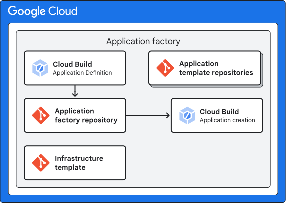

# 4. Application Factory phase

## Purpose

The application factory creates application project groups, which contain resources responsible for deployment of a single application within the developer platform.

An overview of the application factory pipeline is shown below.


The application factory creates the following resources as defined in the [`app-group-baseline`](./modules/app-group-baseline/) submodule:

* **Application admin project:** A project dedicated for application administration and management.
* **Application environment projects:** A project for the application for each environment (e.g., development, nonproduction, production).
* **Infrastructure repository:** A Git repository containing the Terraform configuration for the application infrastructure.
* **Application infrastucture pipeline:** A Cloud Build pipeline for deploying the application infrastructure specified as Terraform.

It will also create an Application Folder to group your admin projects under it, for example:

```txt
.
└── fldr-common/
    ├── default-example/
    │   ├── hello-world-admin
    │   └── ...
    ├── cymbal-bank/
    │   ├── accounts-userservice-admin
    │   ├── accounts-contacts-admin
    │   ├── ledger-ledger-writer-admin
    │   └── ...
```

## Usage

### Deploying with Google Cloud Build

The steps below assume that you are checkout out on the same level as `terraform-google-enterprise-application` and `terraform-example-foundation` directories.

```txt
.
├── terraform-example-foundation
├── terraform-google-enterprise-application
└── .
```

1. Retrieve Multi-tenant administration project variable value from 1-bootstrap:

    ```bash
    export multitenant_admin_project=$(terraform -chdir=./terraform-google-enterprise-application/1-bootstrap output -raw project_id)

    echo multitenant_admin_project=$multitenant_admin_project
    ```

1. (CSR) Clone the infrastructure pipeline repository:

    ```bash
    gcloud source repos clone eab-applicationfactory --project=$multitenant_admin_project
    ```

1. Initialize the git repository, copy `4-appfactory` code into the repository, cloudbuild yaml files and terraform wrapper script:

    ```bash
    cd eab-applicationfactory
    git checkout -b plan

    cp -r ../terraform-google-enterprise-application/4-appfactory/* .
    cp ../terraform-example-foundation/build/cloudbuild-tf-* .
    cp ../terraform-example-foundation/build/tf-wrapper.sh .
    chmod 755 ./tf-wrapper.sh

    cp -RT ../terraform-example-foundation/policy-library/ ./policy-library
    sed -i 's/CLOUDSOURCE/FILESYSTEM/g' cloudbuild-tf-*
    ```

1. Disable all policies validation:

    ```bash
    rm -rf policy-library/policies/constraints/*
    ```

1. Rename `terraform.example.tfvars` to `terraform.tfvars`.

    ```bash
    mv terraform.example.tfvars terraform.tfvars
    ```

1. Use `terraform output` to get the state bucket value from 1-bootstrap output and replace the placeholder in `terraform.tfvars`.

   ```bash
   export remote_state_bucket=$(terraform -chdir="../terraform-google-enterprise-application/1-bootstrap/" output -raw state_bucket)

   echo "remote_state_bucket = ${remote_state_bucket}"

   sed -i'' -e "s/REMOTE_STATE_BUCKET/${remote_state_bucket}/" ./terraform.tfvars
   ```

1. Update the `terraform.tfvars` file with values for your environment.

1. Commit and push changes. Because the plan branch is not a named environment branch, pushing your plan branch triggers terraform plan but not terraform apply. Review the plan output in your Cloud Build project. https://console.cloud.google.com/cloud-build/builds;region=DEFAULT_REGION?project=YOUR_CLOUD_BUILD_PROJECT_ID

    ```bash
    git add .
    git commit -m 'Initialize multitenant repo'
    git push --set-upstream origin plan
    ```

1. Merge changes to production (shared). Because this is a named environment branch, pushing to this branch triggers both terraform plan and terraform apply. Review the apply output in your Cloud Build project https://console.cloud.google.com/cloud-build/builds;region=DEFAULT_REGION?project=YOUR_CLOUD_BUILD_PROJECT_ID

    ```bash
    git checkout -b production
    git push origin production
    ```

### Running Terraform locally

1. The next instructions assume that you are in the `terraform-google-enterprise-application/4-appfactory` folder.

   ```bash
   cd ../4-appfactory
   ```

1. Rename `terraform.example.tfvars` to `terraform.tfvars`.

   ```bash
   mv terraform.example.tfvars terraform.tfvars
   ```

1. Update the file with values for your environment.

   > TIP: To retrieve the remote state bucket variable, you can run `terraform -chdir=../1-bootstrap/ output -raw state_bucket` command.

You can now deploy the into your common folder.

1. Run `init` and `plan` and review the output.

   ```bash
   terraform -chdir=./envs/shared init
   terraform -chdir=./envs/shared plan
   ```

1. Run `apply`.

   ```bash
   terraform -chdir=./envs/shared apply
   ```

If you receive any errors or made any changes to the Terraform config or `terraform.tfvars`, re-run `terraform -chdir=./envs/shared plan` before you run `terraform -chdir=./envs/shared apply`.

## Troubleshooting

### Project quota exceeded

**Error message:**

```text
Error code 8, message: The project cannot be created because you have exceeded your allotted project quota
```

**Cause:**

This message means you have reached your [project creation quota](https://support.google.com/cloud/answer/6330231).

**Solution:**

In this case, you can use the [Request Project Quota Increase](https://support.google.com/code/contact/project_quota_increase)
form to request a quota increase.

In the support form,
for the field **Email addresses that will be used to create projects**,
use the email address of `projects_step_terraform_service_account_email` that is created by the Terraform Example Foundation 0-bootstrap step.
