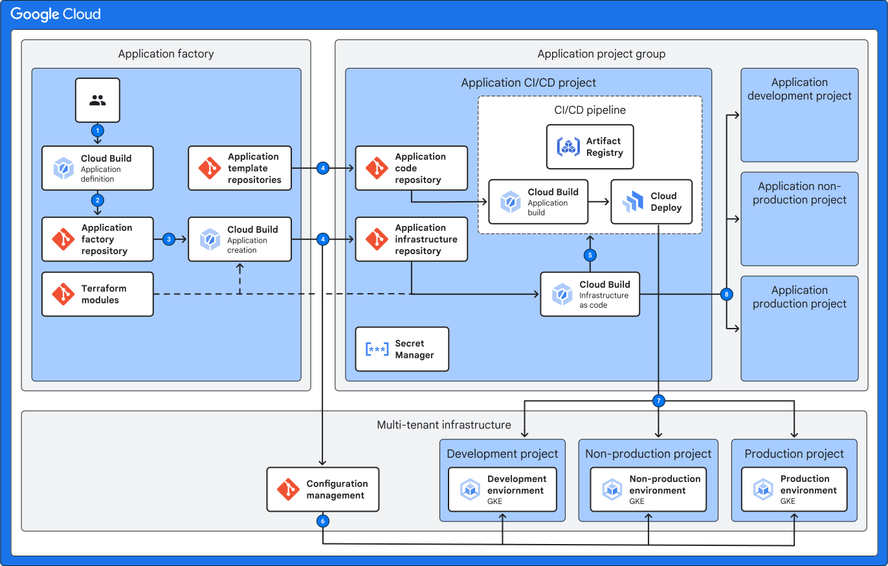

# 5. Application Infrastructure pipeline

This phase configures a CI/CD pipeline for an application, leveraging Google Cloud Build and Cloud Deploy. It automates building, testing, and deploying container images to GKE clusters, with support for various repository types and deployment targets.

<table>
<tbody>
<tr>
<td><a href="../1-bootstrap">1-bootstrap</a></td>
<td>Bootstraps streamlines the bootstrapping process for Enterprise Applications on Google Cloud Platform (GCP)</td>
</tr>
<tr>
<td><a href="../2-multitenant">2-multitenant</a></td>
<td>Deploys GKE clusters optimized for multi-tenancy within an enterprise environment.</td>
</tr>
<tr>
<td><a href="../3-fleetscope"><span style="white-space: nowrap;">3-fleetscope</span></a></td>
<td>Set-ups Google Cloud Fleet, enabling centralized management of multiple Kubernetes clusters.</td>
</tr>
<tr>
<td><a href="../4-appfactory">4-appfactory</a></td>
<td>Sets up infrastructure and CI/CD pipelines for a single application or microservice on Google Cloud</td>
</tr>
<tr>
<td>5-appinfra (this file)</td>
<td>Set up application infrastructure pipelineaims to establish a streamlined CI/CD workflow for applications, enabling automated deployments to multiple environments (GKE clusters).</td>
</tr>
<tr>
<td><a href="../6-appsource">6-appsource</a></td>
<td>Deploys a modified version of a [simple example](https://github.com/GoogleContainerTools/skaffold/tree/main/examples/getting-started) for skaffold.</td>
</tr>
</tbody>
</table>

## Purpose

The application infrastructure pipelineaims to establish a streamlined CI/CD workflow for applications, enabling automated deployments to multiple environments (GKE clusters). It sets up the necessary infrastructure, including repositories, build triggers, and Cloud Deploy pipelines, allowing developers to focus on code development rather than deployment logistics.

An overview of application inrastruction pipeline is shown below, in the context of deploying a new applicaiton across the Enterprise Application blueprint.



### Application CI/CD pipeline

The application infrastructure pipeline creates the following resources to establish the application CI/CD pipeline, as defined in the [`cicd-pipeline`](./modules/cicd-pipeline/) submodule:

- __Artifact Registry Repository:__ Creates a Docker repository in Artifact Registry to store container images.
- __Cloud Build Trigger:__ Configures a Cloud Build trigger that automatically starts a build on code changes in the application repository.
- __Cloud Deploy Delivery Pipeline:__ Defines a Cloud Deploy delivery pipeline that orchestrates the deployment of container images to different target environments.
- __Cloud Deploy Targets:__ Creates Cloud Deploy targets, each representing a GKE cluster where the application will be deployed.
- __Service Accounts:__ Creates service accounts for Cloud Build and Cloud Deploy, with the necessary IAM roles to perform their tasks.
- __Cloud Storage Buckets:__ Creates Cloud Storage buckets for storing build artifacts, Skaffold cache, and release source code.
- __IAM Bindings:__ Grants IAM roles to service accounts, allowing them to access resources in Artifact Registry, Cloud Storage, and GKE clusters.

### Other application infrastructure

The application infrastructure pipeline can create additional resources on a per-environment basis.

In this example, some services are using the [`alloydb-psc-setup`](.modules/alloydb-psc-setup) submodule for creating an AlloyDB Cluster with Private Service Connect.

You may add additional infrastructure like application-specific databases or other managed services by creating and invoking new submodules.

## Usage

### Important Considerations:

- __app_build_trigger_yaml:__ This file should contain the Cloud Build configuration for building and testing the application.
- __cloudbuildv2_repository_config:__ If using GitHub or GitLab integration, ensure that the appropriate secrets are configured in Secret Manager and that the service account has access to those secrets. Follow the validation rules specified in the variable description.

Please note that some steps in this documentation are specific to the selected Git provider. These steps are clearly marked at the beginning of each instruction. For example, if a step applies only to GitHub users, it will be labeled with "(GitHub only)."

### Deploying with Google Cloud Build

The steps below assume that you are checked out on the same level as `terraform-google-enterprise-application` and `terraform-example-foundation` directories.

```txt
.
├── terraform-example-foundation
├── terraform-google-enterprise-application
└── .
```

#### Add Hello World envs at App Infra

1. Retrieve repositories created on 4-appfactory.

    ```bash
    cd eab-applicationfactory/envs/shared/
    terraform init

    export helloworld_project=$(terraform output -json app-group | jq -r '.["default-example.hello-world"]["app_admin_project_id"]')
    echo helloworld_project=$helloworld_project
    export helloworld_repository=$(terraform output -json app-group | jq -r '.["default-example.hello-world"]["app_infra_repository_name"]')
    echo helloworld_repository=$helloworld_repository
    export helloworld_statebucket=$(terraform output -json app-group | jq -r '.["default-example.hello-world"]["app_cloudbuild_workspace_state_bucket_name"]' | sed 's/.*\///')
    echo helloworld_statebucket=$helloworld_statebucket

    cd ../../../
    ```

1. Use `terraform output` to get the state bucket value from 1-bootstrap output and replace the placeholder in `terraform.tfvars`.

   ```bash
   terraform -chdir="./terraform-google-enterprise-application/1-bootstrap/" init
   export remote_state_bucket=$(terraform -chdir="./terraform-google-enterprise-application/1-bootstrap/" output -raw state_bucket)
   echo "remote_state_bucket = ${remote_state_bucket}"
   ```

1. (CSR Only) Clone the repositories for each service and initialize:

    ```bash
    gcloud source repos clone $helloworld_repository --project=$helloworld_project
    ```

1. (GitHub Only) When using GitHub, clone the repository with the following command.

   ```bash
   git clone git@github.com:<GITHUB-OWNER or ORGANIZATION>/$helloworld_repository.git
   ```

   > NOTE: Make sure to replace `<GITHUB-OWNER or ORGANIZATION>` with your actual GitHub owner or organization name.

1. (GitLab Only) When using GitLab, clone the repository with the following command.

   ```bash
   git clone git@gitlab.com:<GITLAB-GROUP or ACCOUNT>/$helloworld_repository.git
   ```

   > NOTE: Make sure to replace `<GITLAB-GROUP or ACCOUNT>` with your actual GitLab group or account name.

1. Copy terraform code for each service repository and replace backend bucket:

    ```bash
    cp -R ./terraform-google-enterprise-application/5-appinfra/* $helloworld_repository
    mv $helloworld_repository/apps/default-example/hello-world/envs/shared/terraform.example.tfvars $helloworld_repository/apps/default-example/hello-world/envs/shared/terraform.tfvars
    cp ./terraform-example-foundation/build/cloudbuild-tf-* $helloworld_repository/
    cp ./terraform-example-foundation/build/tf-wrapper.sh $helloworld_repository/
    chmod 755 $helloworld_repository/tf-wrapper.sh
    sed -i'' -e 's/max_depth=1/max_depth=5/' $helloworld_repository/tf-wrapper.sh
    cp -RT ./terraform-example-foundation/policy-library/ $helloworld_repository/policy-library
    rm -rf $helloworld_repository/policy-library/policies/constraints/*
    sed -i 's/CLOUDSOURCE/FILESYSTEM/g' $helloworld_repository/cloudbuild-tf-*
    sed -i'' -e "s/UPDATE_INFRA_REPO_STATE/$helloworld_statebucket/" $helloworld_repository/apps/default-example/hello-world/envs/shared/backend.tf
    sed -i'' -e "s/REMOTE_STATE_BUCKET/${remote_state_bucket}/" $helloworld_repository/apps/default-example/hello-world/envs/shared/terraform.tfvars
    ```

##### Commit changes to repository

1. Commit files to transactionhistory repository a plan branch:

    ```bash
    cd $helloworld_repository

    git checkout -b plan
    git add .
    git commit -m 'Initialize helloworld repo'
    git push --set-upstream origin plan
    ```

1. Merge plan to production branch:

   ```bash
    git checkout -b production
    git push --set-upstream origin production
    ```

### Running Terraform locally

1. **IMPORTANT** The next instructions assume that you are in the `terraform-google-enterprise-application/5-appinfra` folder.

   ```bash
   cd terraform-google-enterprise-application/5-appinfra
   ```

1. Retrieve state bucket from 4-appfactory and update the example with it:

   ```bash
   export hello_world_statebucket=$(terraform -chdir=../4-appfactory/envs/shared output -json app-group | jq -r '.["default-example.hello-world"].app_cloudbuild_workspace_state_bucket_name' | sed 's/.*\///')
   echo hello_world_statebucket=$hello_world_statebucket

   sed -i'' -e "s/UPDATE_INFRA_REPO_STATE/$hello_world_statebucket/" apps/default-example/hello-world/envs/shared/backend.tf
   ```

1. Use `terraform output` to get the state bucket value from 1-bootstrap output and replace the placeholder in `terraform.tfvars`.

   ```bash
   terraform -chdir="../1-bootstrap/" init
   export remote_state_bucket=$(terraform -chdir="../1-bootstrap/" output -raw state_bucket)
   echo "remote_state_bucket = ${remote_state_bucket}"

   sed -i'' -e "s/REMOTE_STATE_BUCKET/${remote_state_bucket}/" apps/default-example/hello-world/envs/shared/terraform.tfvars
   ```

Under the `apps` folder are examples for each of the applications.

1. Change directory into any of these folders to deploy.

```bash
cd apps/default-example/hello-world
```

1. Use example terraform.tfvars and update values from your environment:

```bash
cp envs/shared/terraform.example.tfvars envs/shared/terraform.tfvars
```

1. Update the configuration with values for your environment.

Deploy the `shared` environment first, which contains the application CI/CD pipeline.

1. Run `init` and `plan` and review the output.

   ```bash
   terraform -chdir=./envs/shared init
   terraform -chdir=./envs/shared plan
   ```

1. Run `apply shared`.

   ```bash
   terraform -chdir=./envs/shared apply
   ```

You can now deploy each of your environments (e.g. production).

1. Run `init` and `plan` and review the output.

   ```bash
   terraform -chdir=./envs/production init
   terraform -chdir=./envs/production plan
   ```

1. Run `apply production`.

   ```bash
   terraform -chdir=./envs/production apply
   ```

If you receive any errors or made any changes to the Terraform config or `terraform.tfvars`, re-run `terraform -chdir=./envs/production plan` before you run `terraform apply -chdir=./envs/production`.
