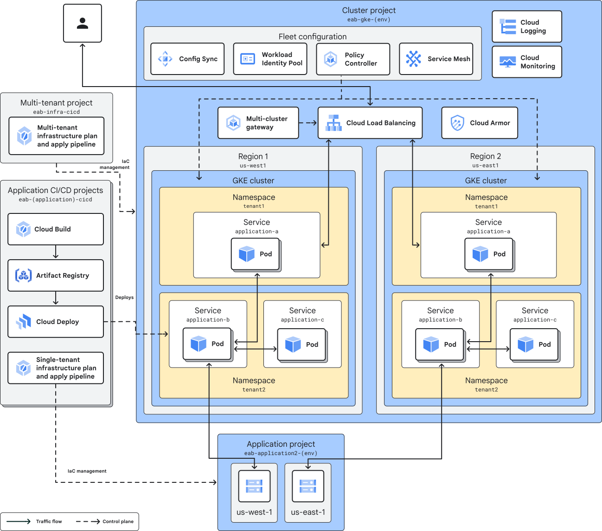

# Enterprise Application blueprint

This example repository shows how to build an enterprise developer platform on Google Cloud, following the [Enterprise Application blueprint](https://cloud.google.com/architecture/enterprise-application-blueprint). This repository deploys an internal developer platform that enables cloud platform teams to provide a managed software development and delivery platform for their organization's application development groups.

The Enterprise Application blueprint adopts practices defined in the [Enterprise Foundation blueprint](https://cloud.google.com/architecture/security-foundations), and is meant to be deployed after deploying the foundation. Refer to the [Enterprise Foundation blueprint repository](https://github.com/terraform-google-modules/terraform-example-foundation) for complete deployment instructions.

## Architecture

For a complete description of the architecture deployed by this repository, refer to the [published guide](https://cloud.google.com/architecture/enterprise-application-blueprint/architecture). See below for a high-level diagram of the architecture:



## Overview

This repository contains several distinct deployment stages, each contained in a directory. Each stage subdirectory represents the contents of a customer-owned repo that will trigger a distinct Terraform deployment pipeline.

### Pre-requisites

- Google Cloud SDK version greater than 487.0.0
- Terraform version greater than 1.6

### [1. bootstrap](/1-bootstrap/)

The bootstrap phase establishes the 3 initial pipelines of the Enterprise Application blueprint. These pipelines are:

- the Multitenant Infrastructure pipeline
- the Application Factory
- the Fleet-Scope pipeline

These 3 pipelines will be contained in a single project. When deploying on the Enterprise Foundation blueprint, create this project as part of the [projects](https://github.com/terraform-google-modules/terraform-example-foundation/tree/master/4-projects) stage in the common folder, and create these resources via the [app-infra](https://github.com/terraform-google-modules/terraform-example-foundation/tree/master/5-app-infra) stage.

```
example-organization
└── fldr-common
    └── prj-c-eab-bootstrap
```

### [2. multitenant](/2-multitenant/)

The purpose of this stage is to deploy the per-environment multitenant resources via the multitenant infrastructure pipeline. The resulting project hierarchy is as follows:

```
example-organization
└── fldr-development
    └── prj-d-eab-multitenant
└── fldr-nonproduction
    └── prj-n-eab-multitenant
└── fldr-production
    └── prj-p-eab-multitenant
```

### [3. fleet-scope](/3-fleet-scope/)

The purpose of this stage is to deploy the per-environment fleet resources via the fleetscope infrastructure pipeline. This stage does not create any new projects, but creates resources within the existing multitenant infrastructure projects.

The fleet-scope pipeline manages configuration and resources related to [GKE Fleets](https://cloud.google.com/kubernetes-engine/docs/fleets-overview). This stage manages the creation of namespaces in the GKE clusters via [team scopes and fleet namespaces](https://cloud.google.com/kubernetes-engine/fleet-management/docs/team-management#fleet_team_management_overview). This pipeline also enables the [Config Sync](https://cloud.google.com/anthos-config-management/docs/config-sync-overview) and [Service Mesh](https://cloud.google.com/service-mesh/docs) features for the fleet and thus the member clusters.

Fleet team management features make it easier for platform admins to provision and manage the necessary infrastructure resources that application and service teams might need to run their workloads, with the appropriate access control. Each team acts as a separate "tenant" on your fleet. In this repository, for demostration purposes, the `ADMIN` permission is assigned on the fleet scope for each Group/Namespace.

### [4. app-factory](/4-app-factory/)

The purpose of this stage is to set up the application-specific projects. This includes a single project in the common folder, and a project in each of the environment folders. The app-infra pipeline creates the application CI/CD pipeline, responsible for deploying applications to the multitenant infrastructure. The app-infra pipeline also creates any application-specific infrastructure, such as databases or other managed services. The resulting project hierarchy is as follows:

```
example-organization
└── fldr-common
    ├── prj-c-eab-app1
    └── prj-c-eab-app2
└── fldr-development
    ├── prj-d-eab-app1
    └── prj-d-eab-app2
└── fldr-nonproduction
    ├── prj-n-eab-app1
    └── prj-n-eab-app2
└── fldr-production
    ├── prj-p-eab-app1
    └── prj-p-eab-app2
```

### [5. appinfra](/5-appinfra/)

The purpose of this stage is to create application-specific infrastructure. This stage deploys the application-specific resources, including service-related infrastructure components such as databases, cloud build triggers, storage buckets, BigQuery datasets, and others. This stage also defines the CI/CD pipeline for each application, targeting the clusters in the multitenant infrastructure stage.

### [6. appsource](/6-appsource/)

The purpose of this stage is to set up application source code repositories, which also includes application-specific configurations. The code within this stage serves as a sample for setting up and deploying the sample applications, including necessary configuration for gateways, services, and deployments. These configurations are deployed via the application CI/CD pipeline deployed at stage 5-appinfra.

## Applications (Apps)

This repo demostrates setting up the developer platform for one or more *Apps* which is a high level of grouping of releated service or workloads. Apps are created infrequently and may include multiple namespaces, team scopes, and dedicated IP address. A multi-tenant cluster can contain multiple Apps.

App-specific resources such as application CI/CD pipelines specification and kubernetes manifests are configured on 5-appinfra and 6-appsource. The table below indicates where you can find the app-specific directories for the examples contained in this repository:

| Application               | 5-appinfra directory                | 6-appsource directory                |
|---------------------------|-------------------------------------|-------------------------------------|
| Hello World               | [./5-appinfra](./5-appinfra)                        | [./6-appsource](./6-appsource)                        |
| Cymbal Bank               | [./examples/cymbal-bank/5-appinfra](./examples/cymbal-bank/5-appinfra)   | [./examples/cymbal-bank/6-appsource](./examples/cymbal-bank/6-appsource)   |
| Cymbal Shop               | [./examples/cymbal-shop/5-appinfra](./examples/cymbal-shop/5-appinfra)   | [./examples/cymbal-shop/6-appsource](./examples/cymbal-shop/6-appsource)   |
| Cymbal Bank + Cymbal Shop | [./examples/multitenant-applications/6-appsource](./examples/multitenant-applications/6-appsource) | [./examples/multitenant-applications/6-appsource](./examples/multitenant-applications/6-appsource) |

### Hello World Example

This [hello-world](https://github.com/GoogleContainerTools/skaffold/tree/v2.13.2/examples/getting-started) example is a very simple Go application that is deployed along with the codebase as a placeholder, it uses basic skaffold features:

- **building** a single Go file app and with a multistage `Dockerfile` using local docker to build
- **tagging** using the default tagPolicy (`gitCommit`)
- **deploying** a single container pod using `kubectl`

The example is extracted from the skaffold repository and the source code is stored in `6-appsource/hello-world`.

### [Cymbal Bank Example](./examples/cymbal-bank/)

The [Cymbal Bank](https://github.com/GoogleCloudPlatform/bank-of-anthos) (`cymbal-bank`) sample App is included in the repository. Within each stage there are specific configurations needed for deploying the sample application. For custom applications, be sure to replace the existing Cymbal Bank content with your own applications and configurations.

### [Cymbal Shop Example](./examples/cymbal-shop/)

The application is a web-based e-commerce app where users can browse items, add them to the cart, and purchase them.

In the developer platform, it is deployed into a single namespace/fleet scope (`cymbalshops`). All the 11 microservices that build this application are deployed through a single `admin` project using Cloud Deploy. This means only one `skaffold.yaml` file is required to deploy all services.

For more information about the Cymbal Shop application, please visit [microservices-demo repository](https://github.com/GoogleCloudPlatform/microservices-demo/tree/v0.10.1).

### [Multitenant Applications Example](./examples/multitenant-applications)

This example demonstrates modifications necessary to deploy two separate application in the cluster, the applications are named `cymbal-bank` and `cymbal-shop`. `cymbal-bank` microservices will be deployed across differente namespaces, to represent different teams, and each microservice will have its own `admin` project, which hosts the CI/CD pipeline for the microservice. `cymbal-shop` microservices will be deployed into a single namespace and all pipelines into a single `admin` project. See the 4-appfactory [terraform.tfvars](./examples/multitenant-applications/4-appfactory/terraform.tfvars) for more information on how these projects are specified.

## Contributing

Refer to the [contribution guidelines](./CONTRIBUTING.md) for
information on contributing to this module.

## Security Disclosures

Please see our [security disclosure process](./SECURITY.md).
