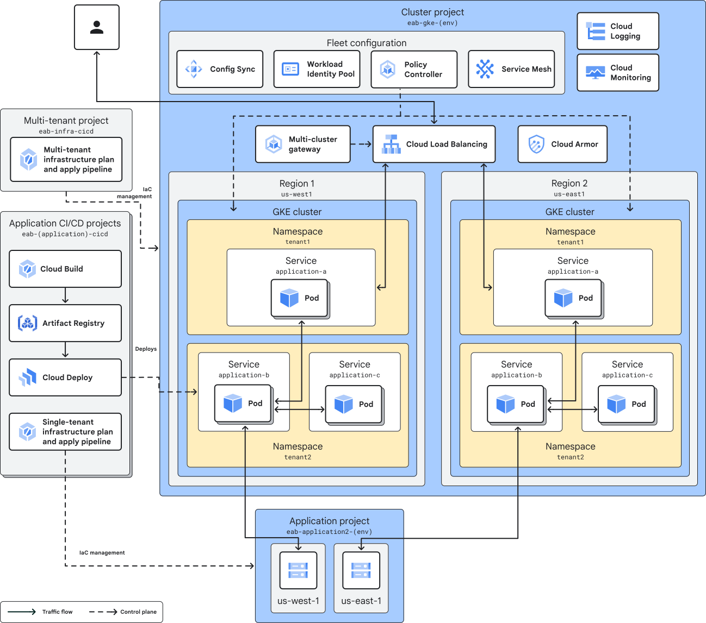

# Enterprise Application blueprint
This example repository shows how to build an enterprise developer platform on Google Cloud, follwing the [Enterprise Application blueprint](https://cloud.google.com/architecture/enterprise-application-blueprint). This repository deploys an internal developer platform that enables cloud platform teams to provide a managed software development and delivery platform for their organization's application development groups.

The Enterprise Application blueprint adopts practices defined in the [Enterprise Foundation blueprint](https://cloud.google.com/architecture/security-foundations), and is meant to be deployed after deploying the foundation. Refer to the [Enterprsie Foundation blueprint repository](https://github.com/terraform-google-modules/terraform-example-foundation) for complete deployment instructions.

## Architecture 
For a complete description of the architecture deployed by this repository, refer to the [published guide](https://cloud.google.com/architecture/enterprise-application-blueprint/architecture). See below for a high-level diagram of the architecture:



## Overview
This repository contains several distinct deployment stages, each contained in a directory. Each stage subdirectory represents the contents of a customer-owned repo that will trigger a distinct Terraform deployment pipeline.

### [1. bootstrap](/1-bootstrap/)
The bootstrap phase establishes the 3 initial pipelines of the Enterprise Application blueprint. These pipelines are:
- the Multitenant Infrastructure pipeline
- the Application Factory
- the Fleet-Scope pipeline

These 3 pipelines will be contained in a single project. When deploying on the Enterprise Foundation blueprint, create this project as part of the [projects](https://github.com/terraform-google-modules/terraform-example-foundation/tree/master/4-projects) stage in the common folder, and create these resources via the [app-infra](https://github.com/terraform-google-modules/terraform-example-foundation/tree/master/5-app-infra) stage.

```
example-organization
└── fldr-common
    └── prj-c-eab-bootstrap
```

### [2. multitenant](/2-multitenant/)
The purpose of this stage is to deploy the per-environment multitenant resources via the multitenant infrastructure pipeline. The resulting project hierarchy is as follows:
```
example-organization
└── fldr-development
    └── prj-d-eab-multitenant
└── fldr-nonproduction
    └── prj-n-eab-multitenant
└── fldr-production
    └── prj-p-eab-multitenant
```

### [3. app-factory](/3-app-factory/)

The purpose of this stage is to set up the application-specific projects. This includes a single project in the common folder, and a project in each of the environment folders. The app-infra pipeline creates the application CI/CD pipeline, responsible for deploying applications to the multitenant infrastructure. The app-infra pipeline also creates any application-specific infrastructure, such as databases or other managed services. The resulting project hierarchy is as follows:

```
example-organization
└── fldr-common
    ├── prj-c-eab-app1
    └── prj-c-eab-app2
└── fldr-development
    ├── prj-d-eab-app1
    └── prj-d-eab-app2
└── fldr-nonproduction
    ├── prj-n-eab-app1
    └── prj-n-eab-app2
└── fldr-production
    ├── prj-p-eab-app1
    └── prj-p-eab-app2
```

### [4. fleet-scope](/4-fleet-scope/)
The purpose of this stage is to deploy the per-environment fleet resources via the fleetscope infrastructure pipeline. This stage does not create any new projects, but creates resources within the existing multitenant infrastructure projects.

### [5. appinfra](/5-appinfra/)
The purpose of this stage is to create application-speciifc infrastructure, including the application CI/CD pipeline. 

### [6. appsource](/6-appsource/)
The purpose of this stage is to set up application source code repositories, which also includes application-specific configurations.

## Contributing

Refer to the [contribution guidelines](./CONTRIBUTING.md) for
information on contributing to this module.

[iam-module]: https://registry.terraform.io/modules/terraform-google-modules/iam/google
[project-factory-module]: https://registry.terraform.io/modules/terraform-google-modules/project-factory/google
[terraform-provider-gcp]: https://www.terraform.io/docs/providers/google/index.html
[terraform]: https://www.terraform.io/downloads.html

## Security Disclosures

Please see our [security disclosure process](./SECURITY.md).
