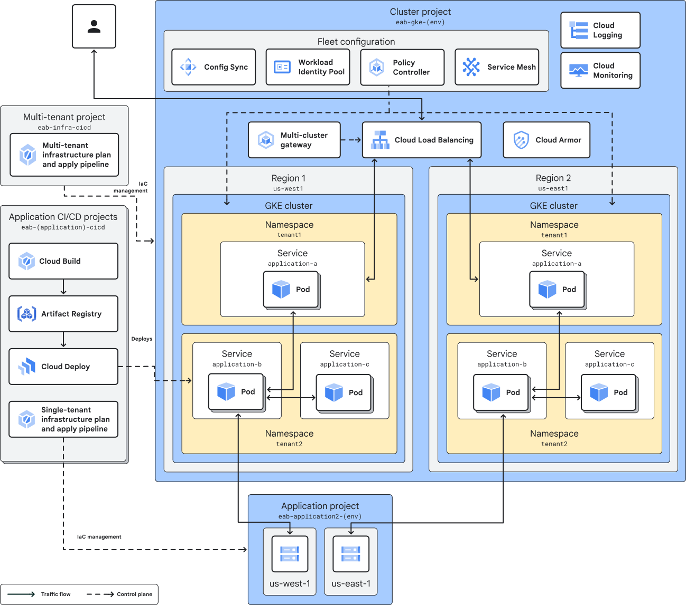

# Enterprise Application blueprint

This example repository shows how to build an enterprise developer platform on Google Cloud, following the [Enterprise Application blueprint](https://cloud.google.com/architecture/enterprise-application-blueprint). This repository deploys an internal developer platform that enables cloud platform teams to provide a managed software development and delivery platform for their organization's application development groups.

The Enterprise Application blueprint adopts practices defined in the [Enterprise Foundation blueprint](https://cloud.google.com/architecture/security-foundations), and is meant to be deployed after deploying the foundation. Refer to the [Enterprise Foundation blueprint repository](https://github.com/terraform-google-modules/terraform-example-foundation) for complete deployment instructions.

## Architecture

For a complete description of the architecture deployed by this repository, refer to the [published guide](https://cloud.google.com/architecture/enterprise-application-blueprint/architecture). See below for a high-level diagram of the architecture:

## Overview

This repository is designed with a highly modular and example-driven structure. To facilitate reuse, clean separation of duties, and ease of deployment, all foundational infrastructure components are implemented as reusable Terraform **Modules**, while end-to-end reference deployments, pipelines, and workloads are contained in the **Examples** directory.

### Core Modules (`/modules`)

The `modules/` directory contains the primary infrastructure components of the Enterprise Application blueprint:

*   **[`modules/gke`](/modules/gke/)**: Provisions the per-environment multi-tenant GKE clusters, database instances (Cloud SQL PostgreSQL), endpoints, and Cloud Armor security policies.
*   **[`modules/fleetscope`](/modules/fleetscope/)**: Configures GKE clusters as a unified fleet. It manages team scopes, namespaces, ACM (Anthos Config Management) with Config Sync, Service Mesh (ASM), and Policy Controller.
*   **[`modules/secure-cicd-pipeline`](/modules/secure-cicd-pipeline/)**: Creates secure, isolated, and VPC-SC-compliant application CI/CD pipelines with Cloud Build private worker pools.
*   **[`modules/deployment-pipeline`](/modules/deployment-pipeline/)**: Defines secure application delivery and deployment configurations using Cloud Build and Cloud Deploy pipelines.
*   **[`modules/standalone-harness`](/modules/standalone-harness/)**: Provisions the required baseline harness infrastructure for standalone and sandboxed single-project setups.
*   **[`modules/alloydb-psc-setup`](/modules/alloydb-psc-setup/)**: Establishes secure AlloyDB instances with Private Service Connect (PSC).
*   **[`modules/cluster_network`](/modules/cluster_network/)**, **[`modules/nat`](/modules/nat/)**, and **[`modules/private_workerpool`](/modules/private_workerpool/)**: Submodules and automation for advanced networking, worker-pool isolation, and routing.

### Deployment Examples (`/examples`)

The `examples/` directory contains end-to-end architectures demonstrating various use cases, deployment topologies, and workload types:

*   **[`examples/default-example`](/examples/default-example/)**: The primary multi-project reference deployment containing stages for App Factory (`4-appfactory`), Application Infrastructure (`5-appinfra`), and the sample Hello World source code (`6-appsource`).
*   **[`examples/standalone_single_project`](/examples/standalone_single_project/)** and **[`examples/standalone_single_project_confidential_nodes`](/examples/standalone_single_project_confidential_nodes/)**: Simplified, rapid-evaluation sandbox environments deploying multitenant, fleetscope, and appinfra in a single project (with confidential nodes support for increased security).
*   **[`examples/cymbal-bank`](/examples/cymbal-bank/)**: Deployment configurations for the microservices-based Cymbal Bank reference application on the internal developer platform.
*   **[`examples/cymbal-shop`](/examples/cymbal-shop/)**: Deployment configurations for the web-based e-commerce Cymbal Shop reference application.
*   **[`examples/multitenant-applications`](/examples/multitenant-applications/)**: Shows how to configure multi-tenant GKE clusters to safely co-host both Cymbal Bank and Cymbal Shop with strict team namespace and scope isolation.
*   **[`examples/agent`](/examples/agent/)**: Deploys an LLM-based agent application utilizing the platform infrastructure.
*   **[`examples/llm-model`](/examples/llm-model/)**: Demonstrates secure machine learning and LLM model deployment pipelines.
*   **[`examples/hpc`](/examples/hpc/)**: High-Performance Computing (HPC) setups showcasing financial Monte Carlo simulation and AI/TensorFlow training on GPUs.
*   **[`examples/htc`](/examples/htc/)**: High-Throughput Computing (HTC) configurations utilizing GKE and Kueue to orchestrate batch and queue jobs.
*   **[`examples/cluster-multicluster-discovery`](/examples/cluster-multicluster-discovery/)**: Explains multi-cluster service discovery setups for decentralized GKE Fleets.

### Pre-requisites

- Google Cloud SDK version greater than 487.0.0
- Terraform version greater than 1.6
- A project already created with a linked billing account

For sandbox and testing purposes, you can use the prerequisite harness located in **[`test/setup`](/test/setup/)**, which deploys a sandbox project, a test service account, a Hub VPC with regional proxies, and Network Connectivity Center (NCC) configured in STAR topology.

---

## Applications (Apps)

This repository demonstrates how to set up the developer platform for one or more *Apps* (a high-level grouping of related services or workloads). Platform teams create Apps infrequently. Apps can include multiple namespaces, team scopes, and dedicated IP addresses. A multi-tenant cluster can host multiple Apps.

Define app-specific resources, such as application CI/CD pipeline specifications and Kubernetes manifests, in the `5-appinfra` and `6-appsource` directories. The table below indicates where you can find the app-specific directories for the examples contained in this repository:

| Application               | 5-appinfra directory                | 6-appsource directory                |
|---------------------------|-------------------------------------|-------------------------------------|
| Hello World               | [examples/default-example/5-appinfra](/examples/default-example/5-appinfra) | [examples/default-example/6-appsource](/examples/default-example/6-appsource) |
| Cymbal Bank               | [examples/cymbal-bank/5-appinfra](/examples/cymbal-bank/5-appinfra)   | [examples/cymbal-bank/6-appsource](/examples/cymbal-bank/6-appsource)   |
| Cymbal Shop               | [examples/cymbal-shop/5-appinfra](/examples/cymbal-shop/5-appinfra)   | [examples/cymbal-shop/6-appsource](/examples/cymbal-shop/6-appsource)   |
| Cymbal Bank + Cymbal Shop | [examples/multitenant-applications/5-appinfra](/examples/multitenant-applications/5-appinfra) | [examples/multitenant-applications/6-appsource](/examples/multitenant-applications/6-appsource) |

### Hello World Example

This [hello-world](https://github.com/GoogleContainerTools/skaffold/tree/v2.13.2/examples/getting-started) example is a very simple Go application that is deployed along with the codebase as a placeholder, using basic skaffold features:

- **building** a single Go file app with a multistage `Dockerfile` using local docker to build
- **tagging** using the default tagPolicy (`gitCommit`)
- **deploying** a single container pod using `kubectl`

You can find the source code and skaffold configurations in [`examples/default-example/6-appsource/default-example`](/examples/default-example/6-appsource/default-example/).

### [Cymbal Bank Example](./examples/cymbal-bank/)

The repository includes the [Cymbal Bank](https://github.com/GoogleCloudPlatform/bank-of-anthos) (`cymbal-bank`) sample App. Each stage requires specific configurations for deploying the sample application. For custom applications, replace the existing Cymbal Bank content with your own applications and configurations.

### [Cymbal Shop Example](./examples/cymbal-shop/)

The application is a web-based e-commerce app where users can browse items, add them to the cart, and purchase them.

In the developer platform, it is deployed into a single namespace/fleet scope (`cymbalshops`). All the 11 microservices that build this application are deployed through a single `admin` project using Cloud Deploy. This means only one `skaffold.yaml` file is required to deploy all services.

For more information about the Cymbal Shop application, please visit [microservices-demo repository](https://github.com/GoogleCloudPlatform/microservices-demo/tree/v0.10.1).

### [Multitenant Applications Example](./examples/multitenant-applications)

This example demonstrates the modifications necessary to deploy two separate applications in the cluster: `cymbal-bank` and `cymbal-shop`. `cymbal-bank` microservices are deployed across different namespaces to represent different teams, and each microservice has its own `admin` project hosting its CI/CD pipeline. `cymbal-shop` microservices are deployed into a single namespace, with all pipelines in a single `admin` project. See the 4-appfactory [terraform.tfvars](./examples/multitenant-applications/4-appfactory/terraform.tfvars) for more details.

## HPC Use Cases

In the `examples/hpc` directory, you will find code samples and detailed instructions for provisioning two distinct use cases utilizing `Kueue` to efficiently manage batch jobs across multiple teams within the developer platform.

### Use Cases

#### 1. Monte Carlo Financial Analysis

This use case demonstrates how to implement simulation for financial analysis. The example includes setup instructions to get started with running high-performance calculation batch jobs.

#### 2. AI Training on GKE Using GPU and TensorFlow

This use case showcases the process of training AI models using Google Kubernetes Engine (GKE) with GPU support and TensorFlow. The documentation provides guidance on configuring the environment and creating machine learning training jobs.

## Team Structure

Each team, namely **hpc-team-a** and **hpc-team-b**, operates within their own dedicated tenants, infrastructure projects, and environments for executing their applications. The shared resources between the two teams are the cluster created in `2-multitenant` (managed by GKE modules) and Kueue's [ClusterQueue](https://kueue.sigs.k8s.io/docs/concepts/cluster_queue/):

For a more detailed guide on how to set up and deploy these use cases, refer to the code and instructions provided in the `examples/hpc` directory.

## Contributing

Refer to the [contribution guidelines](./CONTRIBUTING.md) for information on contributing to this module.

## Security Disclosures

Please see our [security disclosure process](./SECURITY.md).

<!-- BEGINNING OF PRE-COMMIT-TERRAFORM DOCS HOOK -->
## Inputs

No inputs.

## Outputs

No outputs.

<!-- END OF PRE-COMMIT-TERRAFORM DOCS HOOK -->
