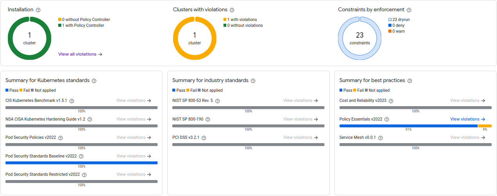

# OPA Policies on GKE

## Overview

Based on the open source [Open Policy Agent Gatekeeper](https://open-policy-agent.github.io/gatekeeper/website/docs/) project, [Policy Controller](https://cloud.google.com/kubernetes-engine/enterprise/policy-controller/docs/overview) is fully integrated with Google Cloud, includes a built-in dashboard, for observability, and comes with a full library of pre-built policies for common security and compliance controls.

Policy Controller is installed in this repository on the 3-fleetscope stage.

For more information on the dashboard, see [Policy Controller Status](https://cloud.google.com/kubernetes-engine/enterprise/policy-controller/docs/how-to/policy-controller-status).

## Installed Bundles

By default, two policies bundles are installed with the cluster:

Bundle Code | Name | Description |
--- | -- | -- |
pss-baseline-v2022 | Pod Security Standards Baseline | Apply protections based on the Kubernetes Pod Security Standards (PSS) Baseline policy. |
policy-essentials-v2022 | Policy Essentials | Apply best practices to your cluster resources |

### `pss-baseline-v2022` details

| Constraint Name                                   | Description                                          | Control Name                  |
|---------------------------------------------------|------------------------------------------------------|-------------------------------|
| pss-baseline-v2022-apparmor                       | The AppArmor profile used by containers              | AppArmor                      |
| pss-baseline-v2022-capabilities                    | Linux capabilities                                   | Capabilities                  |
| pss-baseline-v2022-host-namespaces-host-pid-ipc   | Usage of host namespaces                             | Host Namespaces               |
| pss-baseline-v2022-host-namespaces-hostnetwork     | Use of host networking                               | Host Networking               |
| pss-baseline-v2022-host-ports                      | Usage of host ports                                  | Host Ports (configurable)     |
| pss-baseline-v2022-hostpath-volumes                | Usage of the host filesystem                         | HostPath Volumes              |
| pss-baseline-v2022-hostprocess                     | Usage of Windows HostProcess                         | HostProcess                   |
| pss-baseline-v2022-privileged-containers           | Running of privileged containers                     | Privileged Containers         |
| pss-baseline-v2022-proc-mount-type                 | The Allowed Proc Mount types for the container       | /proc Mount Type              |
| pss-baseline-v2022-seccomp                         | The seccomp profile used by containers               | Seccomp                       |
| pss-baseline-v2022-selinux                         | The SELinux context of the container                 | SELinux                       |
| pss-baseline-v2022-sysctls                         | The sysctl profile used by containers                | Sysctls                      |

### `policy-essentials-v2022` details

This bundle of constraints addresses and enforces policies in the following domains:

- RBAC and service accounts
- Pod Security Policies
- Container Network Interface (CNI)
- Secrets management
- General policies

Constraint | Description |
| - | - |
policy-essentials-v2022-no-secrets-as-env-vars | Prefer using Secrets as files over Secrets as environment variables
policy-essentials-v2022-pods-require-security-context | Apply Security Context to your Pods and containers
policy-essentials-v2022-prohibit-role-wildcard-access | Minimize the use of wildcards in Roles and ClusterRoles.
policy-essentials-v2022-psp-allow-privilege-escalation-container | Minimize the admission of containers with allowPrivilegeEscalation
policy-essentials-v2022-psp-capabilities | Containers must drop the `NET_RAW` capability and aren't permitted to add back any capabilities.
policy-essentials-v2022-psp-host-namespace | Minimize the admission of containers with `hostPID` or `hostIPC` set to `true`.
policy-essentials-v2022-psp-host-network-ports | Minimize the admission of containers wanting to share the host network namespace
policy-essentials-v2022-psp-pods-must-run-as-nonroot | Minimize the admission of root containers
policy-essentials-v2022-psp-privileged-container | Minimize the admission of privileged containers
policy-essentials-v2022-psp-seccomp-default | Ensure that the seccomp profile is set to `runtime/default` or `docker/default` in your Pod definitions
policy-essentials-v2022-restrict-clusteradmin-rolebindings | Minimize the use of the cluster-admin role.

## Validating Correct Installation

After installing Policy Controller, you can verify that it completed successfully by running the following command:

```bash
gcloud container fleet policycontroller describe --memberships=MEMBERSHIP_NAME
```

You can also validate the installed constraints by running:

```bash
kubectl get constrainttemplates
```

## Violations Validation Example

If you want to validate the violations for the `pss-baseline-v2022` policy bundle, for example, you can run the following command:

```bash
kubectl get constraint -l policycontroller.gke.io/bundleName=pss-baseline-v2022 -o json | jq -cC '.items[]| [.metadata.name,.status.totalViolations]'
```

You can also see policies summary on GKE Dashboard, for example:

## Additional Policies

### Adding Bundles

You can add additional Bundles by editing the policy baseline on [3-fleetscope/modules/env_baseline/policy.tf](../3-fleetscope/modules/env_baseline/policy.tf).

For all the available bundles, see [Policy Controller Bundles on GKE](https://cloud.google.com/kubernetes-engine/enterprise/policy-controller/docs/concepts/policy-controller-bundles)

### Adding Individual Policies


for all available contraints template library refer to: <https://cloud.google.com/kubernetes-engine/enterprise/policy-controller/docs/latest/reference/constraint-template-library>

for instructions on using constraint library see: https://cloud.google.com/kubernetes-engine/enterprise/policy-controller/docs/how-to/creating-policy-controller-constraints

### Adding Custom Policies
custom:
<https://cloud.google.com/kubernetes-engine/enterprise/policy-controller/docs/how-to/write-custom-constraint-templates>

