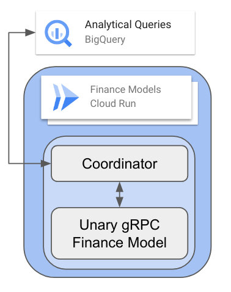
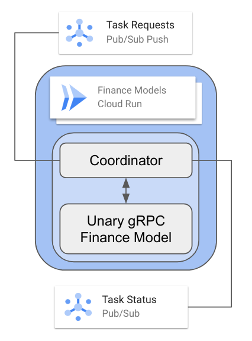
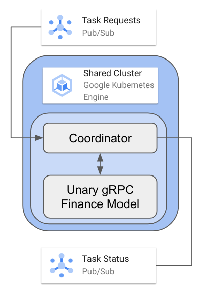
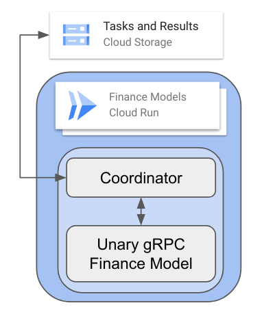

# Agent for HTC

## Overview

The Agent for HTC is a tool for deploying [Unary GRPC](https://grpc.io/docs/what-is-grpc/core-concepts/#unary-rpc) services. This an RPC service
that takes in a [protobuf message](https://protobuf.dev/overview/) and returns a
protobuf message.

This can use the [loadtest](../loadtest) or [american-option](../american-option) as
workloads and will be used in this example. Your own workload can be used as well.

## Agent Modes

The Agent is intended to be deployed as a sidecar to the gRPC service. It can
be deployed in [Cloud Run](https://cloud.google.com/run) or [Google Kubernetes Engine](https://cloud.google.com/kubernetes-engine). Cloud Run
provides scale-to-zero, rapid scaling, and a fully managed service. Google
Kubernetes Engine provides immense flexibility, scalability, and enterprise control.

The following examples are focused in Cloud Run but some can run on Google Kubernetes
Engine (or locally).

### BigQuery



The agent will be deployed alongside the workload in the same container on Cloud Run. It will
receive HTTP requests from [BigQuery Remote Functions](https://cloud.google.com/bigquery/docs/remote-functions), converting
JSON requests into protobuf, dispatching it to the gRPC service, and returning the
results back to BigQuery as JSON.

This enables flexible data anslysis from BigQuery (or notebook leveraging BigQuery),
accessing arbitrary gRPC-based services.

### Pub/Sub Push



The agent will be deployed alongside the workload in the same container on Cloud Run. It will
receive HTTP requests from a [Pub/Sub Push Subscription](https://cloud.google.com/pubsub/docs/push). It will
receive JSON requests, convert into protobuf, dispatching it to the gRPC service,
and publish the protobuf result as JSON into a topic.

### Pub/Sub



The agent will be deployed alongside the workload in the same container on Cloud Run,
the same container on GKE, or on the same machine. It will
receive HTTP requests from a [Pub/Sub Subscription](https://cloud.google.com/pubsub/docs/overview). It will
receive JSON requests from the subscription, convert into protobuf, dispatch it to the gRPC service,
and publish the protobuf result as JSON into a topic.

### File IO



The agent will read from a JSONL file, dispatch each line into gRPC, and write the
results into a JSONL output file.

This is more intended for testing purposes.

## Test Modes

The Agent also includes two modes for testing: gRPC (direct) and Pub/Sub.

For testing it can be used for latency testing (on-going tests, measuring throughput
and latency) or for batch (send all data, wait for all results).

TO BE ADDED.

## Testing Locally

NOTE: It is assumed that loadtest tasks have been generated as `../loadtest/tasks.jsonl`,
and loadtest is running on port 2002. See [loadtest README.md](../loadtest/README.md)
for instructions on getting it running.

### Build the container

```sh
docker build -t agent .
```

### Running File IO

The following command:
  * Runs the container on the host network (so can connect to the gRPC service)
  * Mounts the local loadtest folder (so it can read the task.jsonl)
  * Runs the "agent file" subcommand with the input and output files.
  * Configures the gRPC endpoint, service, and method for targeting the gRPC service.

```sh
docker run \
  --network host \
  -v $PWD/../loadtest:/data \
  agent \
  agent file /data/tasks.jsonl /data/tasks_output.jsonl \
  --endpoint http://localhost:2002/main.LoadTestService/RunLibrary
```

### Running BigQuery

Start the agent in BigQuery RDF mode like with File IO. This will open a port
on 8080 (on the host) for HTTP requests.

```sh
docker run \
  --network host \
  agent \
  --logJSON \
  agent \
  rdf \
  --endpoint http://localhost:2002/main.LoadTestService/RunLibrary
```

Create an input.json file with the following tasks:

```sh
cat > input.json <<EOF
{
  "requestId": "id1",
  "caller": "caller1",
  "sessionUser": "sessionUser1",
  "userDefinedContext": {},
  "calls": [
    [{"task":{"id":"1","minMicros":"500000"}}],
    [{"task":{"id":"2","minMicros":"500000"}}],
    [{"task":{"id":"3","minMicros":"500000"}}],
    [{"task":{"id":"4","minMicros":"500000"}}]
  ]
}
EOF
```

Use curl to test it out:

```sh
curl -H "Content-Type: application/json" --data @input.json http://localhost:8080/
```

### Running Pub/Sub

Create the topics and subscriptions:

```sh
gcloud pubsub topics create test-reqs
gcloud pubsub subscriptions create --topic test-reqs test-reqs-sub
gcloud pubsub topics create test-resps
gcloud pubsub subscriptions create --topic test-resps test-resps-sub
```

```sh
docker run \
  --network host \
  agent \
  agent pubsub \
  --sub-name projects/your-project-id/subscriptions/test-reqs-sub \
  --topic-name projects/your-project-id/topics/test-resps \
  --endpoint http://localhost:2002/main.LoadTestService/RunLibrary
```
Delete the topics and subscriptions:

```sh
gcloud pubsub subscriptions delete test-reqs-sub
gcloud pubsub topics delete test-reqs
gcloud pubsub subscriptions delete test-resps-sub
gcloud pubsub topics delete test-resps
```

Steps:
 * Create two topics and a subscription.
 * Run locally pulling from the subscription and publishing to the topic.


### Running Pub/Sub Push

TO BE COMPLETED.

This requires more curl stuff.
